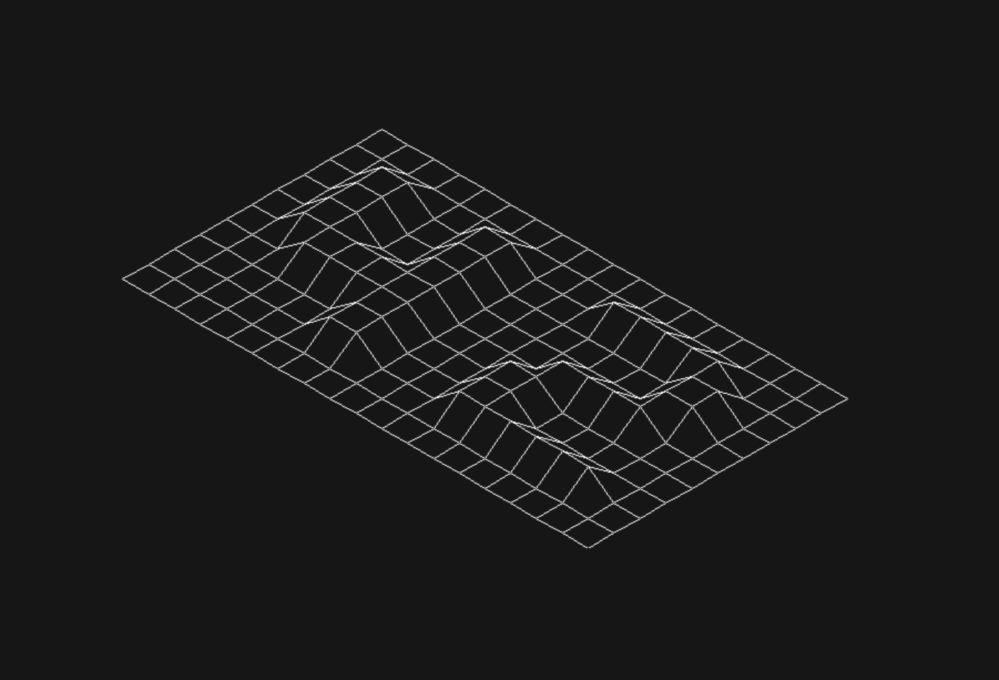
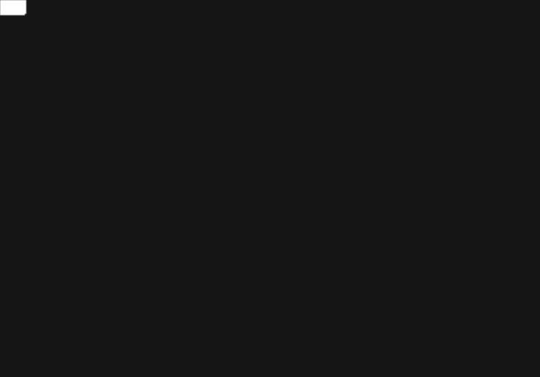

---

_**README.md not finished yet**_

---

```text
 ______________________________________________________________________________
|______________________________________________________________________________|
|________________/\\\\\\\\\\\\\\\____/\\\____/\\\\\\\\\\\\\\\__________________|
|________________\/\\\///////////____\/\\\___\/\\\///////////__________________|
|_________________\/\\\_______________\/\\\___\/\\\____________________________|
|__________________\/\\\\\\\\\\\_______\/\\\___\/\\\\\\\\\\\___________________|
|___________________\/\\\///////___/\\\\\\\\\___\/\\\///////___________________|
|____________________\/\\\_________/\\\////\\\___\/\\\_________________________|
|_____________________\/\\\________\/\\\__\/\\\___\/\\\________________________|
|______________________\/\\\________\//\\\\\\\/\\__\/\\\_______________________|
|_______________________\///__________\///////\//___\///_________________:)____|
|______________________________________________________________________________|
```

**FdF Project Score:** [](https://github.com/JaeSeoKim/badge42)
<br />

# Preface

This project is quite stressfull, specially for someone who doesn't remember the basics of Trigonometry _(or math in general)_, so if you REALLY want to work on _FdF_ aka **Fils de Fer** _(really dumb name btw)_, prepare yourself for some serious headache, unless you're good with VERY BASIC math.

_No seriouslly though, it is not that hard, I'm just really bad when it comes to maths, so please don't be discouraged, it is really worth your while, especially when **good** results start to show up._ :)

# Projet Description

_FdF_ or as they call it **Fils de Fer** is a program that takes a `*.fdf` file as its 1st argument _(it does take other arguments, but we'll see those later)_ as shown in _Figure 1.1_:

```text
$ cat ./test_maps/42.fdf
0  0  0  0  0  0  0  0  0  0  0  0  0  0  0  0  0  0  0
0  0  0  0  0  0  0  0  0  0  0  0  0  0  0  0  0  0  0
0  0 10 10  0  0 10 10  0  0  0 10 10 10 10 10  0  0  0
0  0 10 10  0  0 10 10  0  0  0  0  0  0  0 10 10  0  0
0  0 10 10  0  0 10 10  0  0  0  0  0  0  0 10 10  0  0
0  0 10 10 10 10 10 10  0  0  0  0 10 10 10 10  0  0  0
0  0  0 10 10 10 10 10  0  0  0 10 10  0  0  0  0  0  0
0  0  0  0  0  0 10 10  0  0  0 10 10  0  0  0  0  0  0
0  0  0  0  0  0 10 10  0  0  0 10 10 10 10 10 10  0  0
0  0  0  0  0  0  0  0  0  0  0  0  0  0  0  0  0  0  0
0  0  0  0  0  0  0  0  0  0  0  0  0  0  0  0  0  0  0
```
_**Figure 1.1**_

And converts them into actual graphical maps as shown in _Figure 1.2_:


_**Figure 1.2**_
<br />

That's basically what you should do, but that's just the _Mandatory Part_, the _Bonus Part_ requires you to apply some rotations on the map, some zooming, some altitude manipulation, as well as toggling between different projections _(we'll see what that means in a sec)_, and some other bonus(es) from your choice.

## Minilibx ?!?? What is that ?!??

_Minilibx_ is a _mini_ version of the original graphics library _LibX_.

```text
        ___________________________
       \ Yeah, no Sh%! Sherlock !!! \
         ‾‾‾‾‾ \  | ‾‾‾‾‾‾‾‾‾‾‾‾‾‾‾‾
                \ | ^__^ 
                 \| (oo)\_______
                    (__)\       )\/\
                        ||----w |
                        ||     ||
```

Naah, for real though, _Minilibx_ is what we will be using to :

1. Initialiase a connection with the Graphics Server
2. Create a Window in which we will be outputing stuff
3. Create Images _(you'll know why we'll be doing that later on)_
4. Output strings to the window
5. Get extremelly frustrated with the project and question our overall life choices in this world.

## Ummm, Figure 1.1, what's that ?!??

_Behold the power of confusion (not really)._

Every number on that—so called—map represents a pixel, its position _(x_axis & y_axis)_, and its altitude _(z)_. Let's explain this a little bit more:

```text
 this pixel right here is the (x: 8; y: 0) pixel
 \______________________   ____________________/
                        \ /
 0  0  0  0  0  0  0  0 '0' 0  0  0  0  0  0  0  0  0  0
 0  0  0  0  0  0  0  0  0  0  0  0  0  0  0  0  0  0  0
 0  0 10 10  0  0 10 10  0  0  0 10 10 10 10 10  0  0  0
 0  0 10 10  0  0 10 10  0  0  0  0  0  0  0 10 10  0 '0' < This one right here is 
 0  0 10 10  0  0 10 10  0  0  0  0  0  0  0 10 10  0  0    the (x: 18; y: 3) pixel
 0  0 10 10 10 10 10 10  0  0  0  0 10 10 10 10  0  0  0
 0  0  0 10 10 10 10 10  0  0  0 10 10  0  0  0  0  0  0
 0  0  0  0  0  0 10 10  0  0  0 10 10  0  0  0  0  0  0
 0  0  0  0  0  0 10 10  0  0  0 10 10 10 10 10 10  0  0
 0  0  0  0  0  0  0  0  0  0  0  0  0  0  0  0  0  0  0
'0' 0  0  0  0  0  0  0  0  0  0  0  0  0  0  0  0  0  0
 |\
 | \______________________________________________
 | This one right here is the (x: 0; y: 10) pixel |
  ‾‾‾‾‾‾‾‾‾‾‾‾‾‾‾‾‾‾‾‾‾‾‾‾‾‾‾‾‾‾‾‾‾‾‾‾‾‾‾‾‾‾‾‾‾‾‾‾
```
_**Figure 1.3**_
<br />

To be a little bit less confusing, the words that you're seeying right now on your screen are just a bunch of pixels _(very small light-sources, can be LEDs, or LCD, depends on the screen)_ that emit a certain mixture of lights, usually Red, Green, and Blue, _aka_ **RGB**, to produce a certain color, if the text's color is black, it means that they're omitting no light whatsoever _(actually, this is a specific case for LED screens, it's a little bit different with LCD screens, and other types of screen monitors)_, as Black is the color of _nothingness_, and if the text's color is white, it means that they're omitting 100% Red, 100% Green, and 100% Blue. More on all of this in this [Wikipidea article](https://en.wikipedia.org/wiki/Color_theory)
<br />

You can picture the screen as a matrix, that has a lot of rows and a lot of columns, and at each intersection between these two, we get cells, and in our case, those cells are the tiny-little-itty-bitty Pixels. So now consider each row to be the Y_axis, and each column to be the X_axis, of the map we'll be drawing.
If we print every pixel, without any modification, with a function that takes the coordinates of a pixel, in a opened window, and its color _(x, y, cl )_ like `mlx_pixel_put`, with the following code:

```c
#include <mlx.h>

int main(int argc, char **argv)
{
	void	*mlx_ptr;
	void	*win_ptr;
	int	total_rows;
	int	total_columns;
	int	y;
	int	x;

	// Initialize connection with Graphics Server
	mlx_ptr = mlx_init();
	// Initialize a new window
	win_ptr = mlx_new_window(mlx_ptr, 600, 800, "My first window!");

	// Count of lines on the '.fdf' map
	total_rows = 11;
	// Count of numbers (not digits) on the first line of the '.fdf' map
	total_columns = 19;

	y = 0;
	while (y < total_rows)
	{
		x = 0;
		while (x < total_columns)
		{
			// 0xffffffff is the hex code for the color "white"
			mlx_pixel_put(mlx_ptr, win_ptr, x, y, 0xffffffff);
			++x;
		}
		++y;
	}

	// Keep the window open
	while (1)
		continue ;

	return (0);
}
```
<br />

we would get something like this:


_**Figure 1.4**_
<br />

Notice how we get a little rectangle at the top left corner of our window. That's because the top-left most pixel of the window is considered to be the base point of drawing in Computer Graphics and not just _Minilibx_, and it is the `x: 0; y: 0` pixel.

_**Note:** The little rectangle may seen to have a little empty space in its borttom-right corner, it's just a bug that's on my side._


## What am I supposed to do now ?!??

Well, you can go take a look at those ressources that I included at the bottom of this `README`, get confortable with the various `<mlx.h>` functions, just the easy ones.


### Very useful ressources _(and the base of this README)_

- [42 Minilibx official Repo](https://github.com/42Paris/minilibx-linux)
- [Getting Started with the Minilibx](https://aurelienbrabant.fr/blog/getting-started-with-the-minilibx)
- [Pixel Drawing with the Minilibx](https://aurelienbrabant.fr/blog/pixel-drawing-with-the-minilibx)
- [Managing Events with the Minilibx](https://aurelienbrabant.fr/blog/managing-events-with-the-minilibx)
- [42 UNofficial Documentation of Minilibx](https://harm-smits.github.io/42docs/libs/minilibx)
- [Another 42 UNofficial Documentation of Minilibx](https://gontjarow.github.io/MiniLibX/)
- [FdF CookBook](https://stackoverflow.com/c/42network/questions/164)
- [Interesing GitHub repo with a lot of useful stuff](https://github.com/qst0/ft_libgfx#the-graphics-branch)
- [How to draw in an image instead of directly in the window, and why you should do that.](https://github.com/keuhdall/images_example)

---

_**P.S.**: If you liked what you've just read, I would really appreciate it if you star this Repo. It really helps with them SEO stuff._
